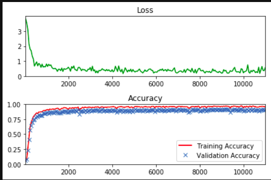

# **Traffic Sign Recognition** 


### [View all Roadmaps](https://github.com/nholuongut/all-roadmaps) &nbsp;&middot;&nbsp; [Best Practices](https://github.com/nholuongut/all-roadmaps/blob/main/public/best-practices/) &nbsp;&middot;&nbsp; [Questions](https://www.linkedin.com/in/nholuong/)
<br/>

### Below is the depth review of my traffic sign recognition project based on german traffic sign data set .

---

**Build a Traffic Sign Recognition Project**

The goals / steps of this project are the following:
* Load the data set (see below for links to the project data set)
* Explore, summarize and visualize the data set
* Design, train and test a model architecture
* Use the model to make predictions on new images
* Analyze the softmax probabilities of the new images
* Summarize the results with a written report


[//]: # (Image References)

[image1]: ./examples/visualization.jpg "Visualization"
[image2]: ./examples/grayscale.jpg "Grayscaling"
[image3]: ./examples/random_noise.jpg "Random Noise"
[image4]: ./examples/placeholder.png "Traffic Sign 1"
[image5]: ./examples/placeholder.png "Traffic Sign 2"
[image6]: ./examples/placeholder.png "Traffic Sign 3"
[image7]: ./examples/placeholder.png "Traffic Sign 4"
[image8]: ./examples/placeholder.png "Traffic Sign 5"


---


### Data Set Summary & Exploration

#### 1. Provide a basic summary of the data set. In the code, the analysis should be done using python, numpy and/or pandas methods rather than hardcoding results manually.

I used the pandas library to calculate summary statistics of the traffic
signs data set:

* The size of training set is  34799
* The size of the validation set is 4410
* The size of test set is 12630
* The shape of a traffic sign image is  32, 32, 3
* The number of unique classes/labels in the data set is 43

#### 2. Include an exploratory visualization of the dataset.

Here is an exploratory visualization of the data set. It is a bar chart showing how the data distribution is ...


### Design and Test a Model Architecture


#### 3. LeNet5 Model Architecture .


 


#### 4. Model Training Results


 

### Test a Model on New Images

#### 1. Test out the model with some challenging  images to Handel even with human eyes .


### Run the notebook your self

1. Download the data set [German Traffic Sign Dataset](http://benchmark.ini.rub.de/?section=gtsrb&subsection=dataset) . This is a pickled dataset in which we've already resized the images to 32x32. It contains a training, validation and test set.
2. Clone the project, which contains the Ipython notebook and the writeup template.
```sh
git clone https://github.com/nholuongut/traffic-sign-recognition.git
cd traffic-sign-recognition
jupyter notebook Traffic_Sign_Classifier.ipynb
```
3. Try out with the trained model inside the results folder

# 🚀 I'm are always open to your feedback.  Please contact as bellow information:
### [Contact ]
* [Name: nho Luong]
* [Skype](luongutnho_skype)
* [Github](https://github.com/nholuongut/)
* [Linkedin](https://www.linkedin.com/in/nholuong/)
* [Email Address](luongutnho@hotmail.com)


[](https://ko-fi.com/nholuong)

# License
* Nho Luong (c). All Rights Reserved.🌟